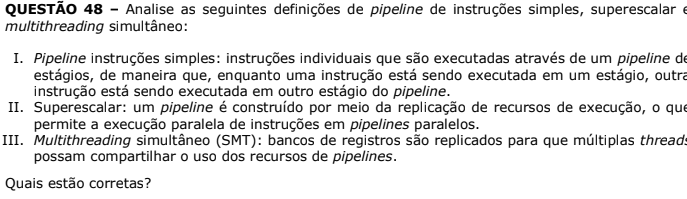

# Guia para revisão e formatação dos JSON

O script R que extrai as questões do PDF para JSON não consegue formatar as questões de maneira totalmente adequada, por exemplo, tabelas e fórmulas matemáticas não são extraídas adequadamente. Dessa forma, é necessário realizar uma revisão manual.

Nesta revisão você deve observando a questão original na prova do POSCOMP formatar o conteúdo do JSON para que fique igual ao original.

## O JSON

O arquivo JSON das questões é composto de 7 campos, respectivamente:

-   Ano: ano ao qual a questão pertence (Inteiro)
-   Num: número da questão na prova a que pertence (Inteiro)
-   Enunciado: enunciado da questão ([String])
-   Alternativas: texto das alternativas ([String])
-   Imagens: urls das imagens no github ([String])
-   Resposta: índice do array de alternativas que contém a resposta correta. (Inteiro)
-   Componente: componente do exame ao qual a questão pertence (String)
-   Subárea: subárea do componente ao qual a questão pertence (String)

## **Instruções**

### Gerais

1.  Remova caracteres especiais mal formatados que não fazem parte do conteúdo

2.  Remova as tabelas e fórmulas mal formatadas

3.  Em caso de dúvida sobre como proceder com alguma questão, consulte o Gerente Geral

4.  ***ATENÇÃO!*** **O conteúdo das questões DEVE permanecer idêntico ao do contido nas provas em PDF.**

### Enunciado contém múltiplos parágrafos

Caso o enunciado da prova cotenha mais de um parágrafos, eles devem ser representados como elementos de um array de elementos no campo Enunciado, por exemplo:



O campo enunciado do JSON deverá ser:

``` {.json}
"Enunciado": [
  "Analise as seguintes definições de pipeline de instruções simples, superescalar e multithreading simultâneo:", 
  "I. Pipeline instruções simples: …", 
  "II. Superescalar: …", 
  "III. Multithreading simultâneo (SMT): …", 
  "Quais estão corretas?"
]
```

A formatação interna do array, pode ser tanto linear quanto quebrada em linhas. Todo `\n` encontrado no texto do enunciado deve ser removido.

Caso o enunciado seja um único parágrafo, ele deve ser mantido como um array com um único elemento.

Caso o enunciado possua parágrafos separados por imagens (ou tabelas, etc), ignore a imagem e unifique o enunciado como o array de parágrafos, citado acima.

### Tabelas

O script R não consegue extrair as tabelas do texto de forma adequada, deixando-as como texto sem formatação dentro do conteúdo do enunciado. Caso o enunciado da questão (ou alguma alternativa) tenha uma tabela associado, você deve tirar um printscreen dessa(s) tabelas e adicioná-las como imagens associadas a questão, veja [Imagens](#imagens).

O texto referente as tabelas deve ser removido do corpo do enunciado e/ou alternativa.

### Fórmulas Matemáticas

O script R não consegue extrair fórmulas matemáticas de forma adequada, de modo que estas ficam mal formatadas e incompletas no texto. Sendo assim, é preciso incluir essas fórmulas utilizando LATEX.

1.  Remova o texto mal formatado correspondente a fórmula

2.  Utilizando [esta](https://www.codecogs.com/latex/eqneditor.php?lang=pt-br) ferramenta gere o código LATEX correspondente a fórmula

3.  No texto, no local onde a respectiva fórmula deveria estar inclua a fórmula LATEX do item anterior entre \$\$.

Para saber mais como funciona o LATEX veja [este vídeo](https://www.youtube.com/watch?v=Jp0lPj2-DQA) (tem legendas em Português). E para ver mais sobre como gerar os símbolos matemáticos consulte [aqui](https://oeis.org/wiki/List_of_LaTeX_mathematical_symbols).

**Obs. 1:** Algumas fórmulas matemáticas foram extraídas como imagens, nesses casos apague a imagem e inclua a fórmula como LATEX.

**Obs. 2:** No vídeo indicado sobre LATEX, ele utiliza \$ para inline latex e \$\$ para gerar uma nova linha com a expressão, porém note que sempre deveremos utilizar \$\$ nos nossos textos como indicado no passo 3, acima.

**Obs. 3:** Caso seja preciso utilizar funções do LATEX, por exemplo `\pi` ou `\frac{}{}`. Usem `\\pi` e `\\frac{}{}` com `\\`, para que o parser do JSON consiga ler.

### Imagens

O script R extraí as imagens do PDF, e as salva na pasta images. Porém as imagens não são relacionadas as questões. Sendo assim, você deve olhar se sua questão tem alguma imagem e procurar por ela na pasta de imagens. Ou ainda, se sua questão possuir tabelas, conforme explicado em [Tabelas](#tabelas).

#### O que deve ser representado como imagem

-   Gráficos

-   Tabelas

-   Trechos de código

-   Diagramas (classe, caso de uso, máquinas de estado, etc)

-   Representações gráficas de Estruturas de Dados (grafos, pilhas, listas, etc)

-   Representações gráficas de Circuitos Lógicos

-   Quaisquer outra representação gráfica

#### Nomeando as imagens

1.  O nome de uma imagem deve ser img-[questão]-[número da imagem]. Por exemplo, suponha que a questão 4 da prova de 2017 tenha duas imagens, essas serão img-04-01 e img-04-02.

2.  Caso a imagem esteja associada a um alternativa, seu nome deve ser img-[questão]-[número da alternativa (0-indexado)]-[número da imagem]. Por exemplo, considere que a questão 12 contém uma imagem associada a alternativa C, ela será img-12-02-01.

#### Inserindo uma imagem no campo Imagens do JSON

1.  O campo imagem deve ser um array.

2.  Insira as imagens como strings separadas por vírgula.

3.  O caminho incluído deve ser [ano da prova]/images/[nome da questão]. Por exemplo, considerando o exemplo anterior da questão 4, teríamos:

    ``` {.json}
    "Imagens": ["2017/images/img-04-01", "2017/images/img-04-02"]
    ```

### Alternativas e Gabarito

As alternativas serão representadas como um array de string, onde cada entrada contém o texto de uma das alternativas, respectivamente de A a E correspondem aos índices de 0 a 4 no array. Todo `\n` (ou carectere especial que não faça parte) encontrado no texto de uma alternativa deve ser removido.

O gabarito deve indicar o índice do array que contém a alternativa correta. Caso o gabarito esteja como -1, indica que esta questão foi anulada no exame. O JSON de uma questão alunada deve ser removido.

### Componente e subárea

O componente deve ser: Matemática, Fundamentos da Computação ou Tecnologia da Computação. A grafia deve ser a que aqui foi dita.

A partir da prova de 2019, no gabarito passou estar incluso a subárea a qual a questão pertence, para estes casos deve ser mantido o conteúdo extraído do gabarito. Nos demais, anos este campo deve ser igual ao componente.
